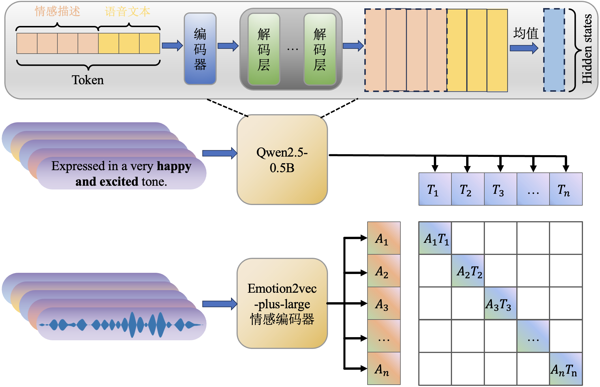
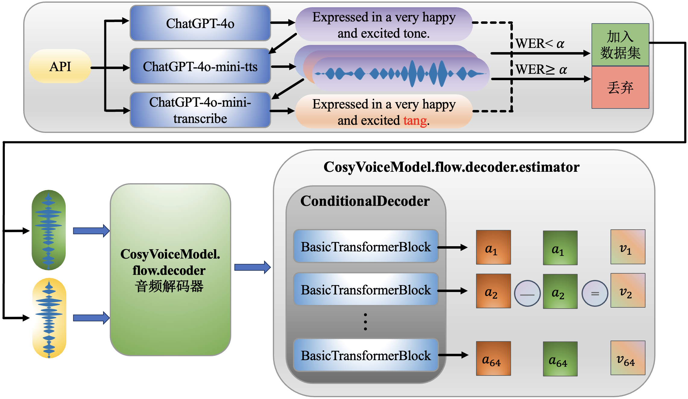
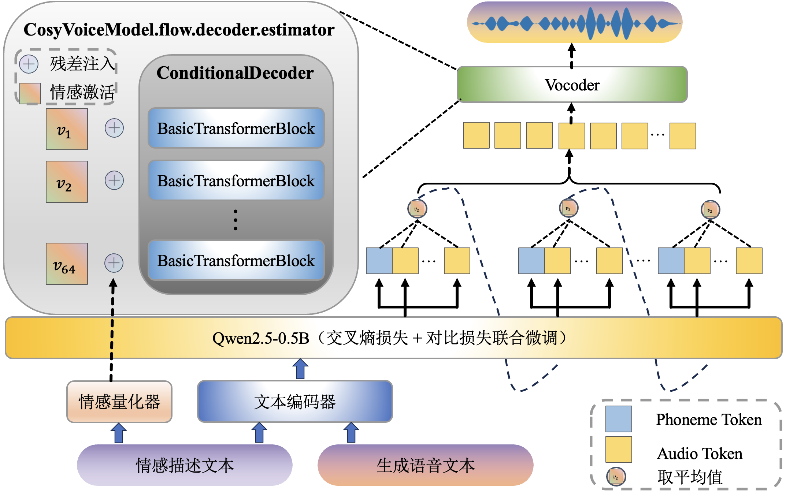

# 中国科学院大学人工智能学院“语音信息处理”大作业







## 实验报告
- 项目完整说明文档：[语音信息处理_实验报告.pdf](./语音信息处理_实验报告.pdf)

## 准备
### 环境、权重、数据
首先按照 [EmoVoice](https://github.com/yanghaha0908/EmoVoice) 配置环境、下载预训练模型权重以及情感微调数据集。

### 下载用于计算情感激活方向的数据集
下载地址为(ModelScope)```FanshuoZeng/EmoVoice-Plus-triplets_wav_data```。
快速下载
```
from modelscope.msdatasets import MsDataset
ds =  MsDataset.load('FanshuoZeng/EmoVoice-Plus-triplets_wav_data')
```

### 生成情感激活方向
```
bash examples/tts/scripts/gene_activate_pt.sh
```
### 离线计算语音情感特征
```
bash examples/tts/scripts/gene_style_emb.sh
```
## 训练
```
bash examples/tts/scripts/ft_EmoVoice-PP-align.sh
```
训练脚本中，```train_config.align.enable=true```表示使用交叉熵损失+对比损失进行训练，```train_config.align.enable=false```表示使用仅交叉熵损失进行训练。
也可以使用我训练好的模型，下载地址为[EmoVoice-Plus-models](https://modelscope.cn/models/FanshuoZeng/EmoVoice-Plus-models)。
快速下载
```
from modelscope import snapshot_download
model_dir = snapshot_download('FanshuoZeng/EmoVoice-Plus-models')
```

可以下载已经训练好的模型权重：
## 推理
```
bash examples/tts/scripts/inference_EmoVoice-PP.sh
```
推理脚本中，```decode_config.emosteer.enable=true```表示使用情感激活注入，```decode_config.emosteer.enable=false```表示不使用情感激活注入。

## 致谢
非常感谢[EmoVoice](https://github.com/yanghaha0908/EmoVoice)的作者们，本项目是基于他们的工作完成的。

